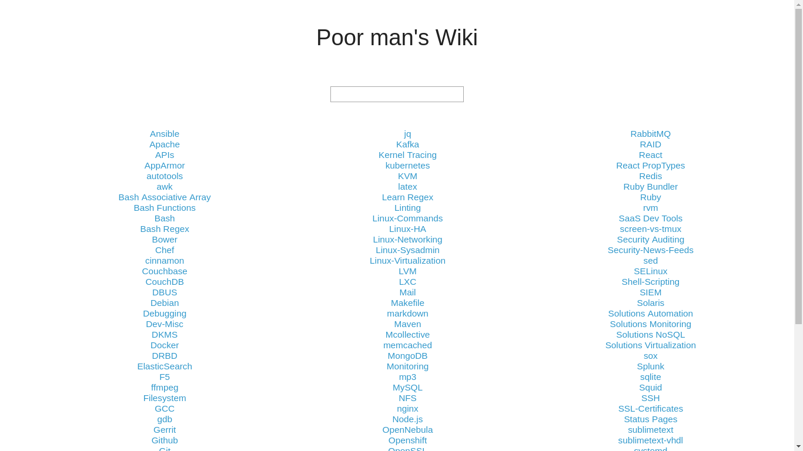

# Poor man's Wiki (Linux, Windows, Mac)


A simple offline Wiki using Chromium and Markdown Viewer.

-

## Features

* Work offline
* Manage your Wiki using Markdown
* Get a nice overview of all your files
* Use Fuzzysearch to find what you need
* Only requires Chromium, Markdown Viewer and Bash or Powershell
* *May also work with Firefox + Markdown Viewer (not tested)*

## Project

```
.
├── images                          (store your images here)
├── webs
│   ├── favicon.png                 (required, icon shown in browser)
│   ├── htmlpreview.min.js          (required)
│   ├── jquery-1.11.3.js            (required)
│   ├── radar.css                   (required, copied from markdown viewer)
│   ├── style.css                   (required, modifications)
│   └── wikis.js                    (required, created by wiki-update.sh)
├── wikis                           (store your wiki entries here)
│   └── wiki-update.sh              (required, run after adding new file)
├── index.html                      (required, start page)
└── README.md
```


## Setting up Chromium

* Install [Markdown Viewer](https://chrome.google.com/webstore/detail/markdown-viewer/ckkdlimhmcjmikdlpkmbgfkaikojcbjk?utm_source=chrome-ntp-icon) for chromium/chrome
* Go to *chrome://extensions/* and enable *"Allow access to file URLs"*


## Setting up Poor man's Wiki

* Download the Repo
* Run the  script:
	- **Linux/Mac**: *wiki-update.sh*
	- **Windows**:   *wiki-update.ps1*
* Open *index.html* in your browser


## Workflow

* Create/Add a new markdown file and run the script
* Refresh your browser


## Sources

I pretty much did nothing it's all just copy and paste.

* [javascript](http://htmlpreview.github.io/?https://github.com/mattyork/fuzzy/blob/master/examples/wikipedia.html)
* [favicon](https://www.google.de/search?q=brain+icon&source=lnms&tbm=isch&sa=X&ved=0ahUKEwiDmbXXxq3YAhWJJ-wKHTrXAfYQ_AUICigB&biw=1362&bih=470)
